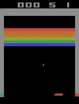
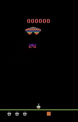

# Atari Agent using Q-Learning

#### Micheal Denzler

If you want to have more information about our implementaiton please look at project description in the pdf file.

## Environments
Gym wrapped implementation of Breakout and Assault Atari games.

## Architecture

#### Neural Networks
Two parallel neural networks (called "Online" and "Target" networks) with each 3 Convolutional layers followed by 2 fully connected layers

#### Loss
Squared error

## Results

#### Breakout

#### Assault

## Contacts 

If you have any doubts please contact us at michael.denzler@usi.ch
